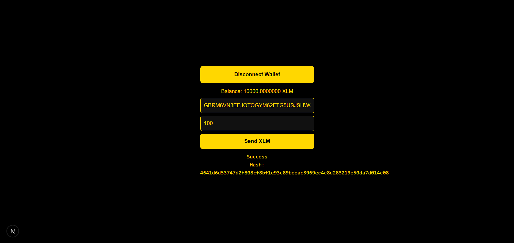

# Stellar Wallet App

A minimal Next.js application that integrates the Freighter wallet to interact with the Stellar network.
The app supports wallet connection, balance retrieval, and sending XLM transactions on the Stellar testnet.

## Features

- Connect and disconnect Freighter wallet
- Detect wallet availability
- Fetch and display XLM balance
- Send XLM transactions on Stellar testnet
- Transaction success and failure feedback
- Transaction hash display
- Clean and centralized UI
- Separation of wallet logic and UI components

## Tech Stack

- Next.js (App Router)
- TypeScript
- React Hooks
- Stellar SDK
- Freighter Wallet API

## Installation

Clone the repository:

- git clone https://github.com/BerkAkipek/stellar-web3
- cd stellar-web3

## Install dependencies:

npm install

## Run development server:

npm run dev

## Open in browser:

http://localhost:3000

## Requirements

Node.js 18+
Freighter wallet browser extension installed
Freighter:
https://www.freighter.app
Network Configuration
The app uses Stellar testnet by default.
Horizon endpoint:
https://horizon-testnet.stellar.org
To fund your test wallet:
https://friendbot.stellar.org
Ensure Freighter is also set to Testnet.

## License

MIT